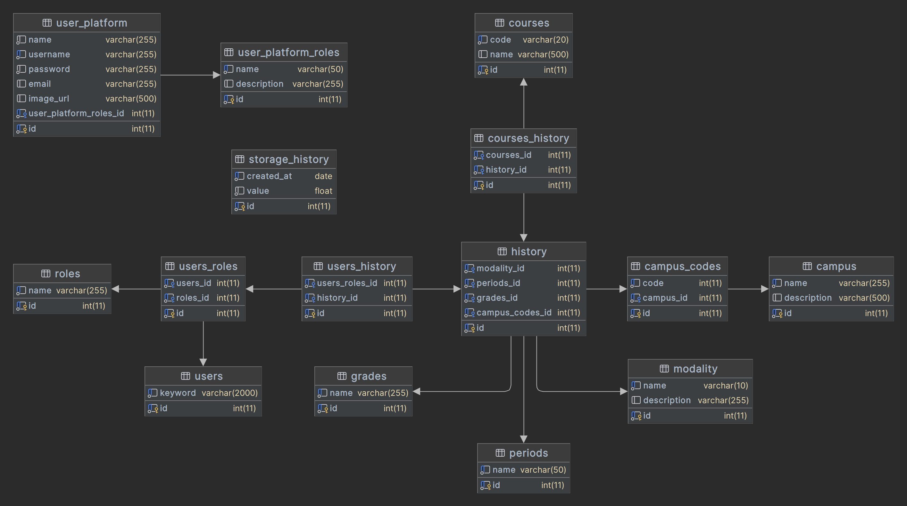

## Usuarios 

| EXTERNAL_COURSE_KEY                    | EXTERNAL_PERSON_KEY          | ROLE    | AVAILABLE_IND |
|----------------------------------------|------------------------------|---------|---------------|
| 20241_100_10002_1201_1_20092_12482_E_4 | mayrubi.jacobo@uabc.edu.mx   | student | Y             |
| 20241_100_10002_231_0_20222_38987_E_1  | ariatna.martinez@uabc.edu.mx | student | Y             |             
| 20241_100_10002_231_0_20222_40302_E_1  | sereno.angel@uabc.edu.mx     | student | Y             |             

Ejemplo **EXTERNAL_COURSE_KEY**: 20241_100_10002_1201_1_20092_12482_E_4

| Periodo | Unidad Academica | Programa | Grupo | SubGrupo | Plan de Estudios | Clave Materia | Modalidad | Tipo Hora |
|---------|------------------|----------|-------|----------|------------------|---------------|-----------|-----------|
| 20241   | 100              | 10002    | 1201  | 1        | 20092            | 12482         | E         | 4         |

## Cursos

| EXTERNAL_COURSE_KEY               | COURSE_ID                         | COURSE_NAME                        | AVAILABLE_IND | CATALOG_IND | TEMPLATE_COURSE_KEY |
|-----------------------------------|-----------------------------------|------------------------------------|---------------|-------------|---------------------|
| 20241_1_101_131_0_20212_38855_E_1 | 20241_1_101_131_0_20212_38855_E_1 | Diseño Arquitectónico I(131)       | N             | Y           | BASE_20202          |                                                                                 
| 20241_1_101_131_0_20212_38856_E_1 | 20241_1_101_131_0_20212_38856_E_1 | Teoría de la Arquitectura I(131)   | N             | Y           | BASE_20202          |                                                                                  
| 20241_1_101_131_0_20212_38857_E_1 | 20241_1_101_131_0_20212_38857_E_1 | Historia de la Arquitectura I(131) | N             | Y           | BASE_20202          |

Ejemplo **COURSE_ID**: 20241_1_101_131_0_20212_38856_E_1

| Periodo | Unidad Academica | Programa | Grupo | SubGrupo | Plan de Estudios | Clave Materia | Modalidad | Tipo Hora |
|---------|------------------|----------|-------|----------|------------------|---------------|-----------|-----------|
| 20241   | 1                | 101      | 131   | 0        | 20212            | 38856         | E         | 1         |

---

## Modalidad
- D = Distancia
- S = Semipresencial
- E = Presencial

## Unidad Academica
Se obtiene el Campus segun el codigo:
- MEXICALI: 1, 2, 10, 40, 80, 90, 110, 111, 123, 124, 125, 126, 140, 160, 200, 220, 222, 260, 300, 310, 335, 337, 605, 625
- TIJUANA: 70, 100, 120, 130, 150, 180, 190, 240, 280, 311, 313, 332, 334, 336, 336, 400, 500, 626, 790
- ENSENADA: 20, 30, 50, 170, 290, 312, 320, 330, 615, 320, 620, 700, 795

--- 
## Database
